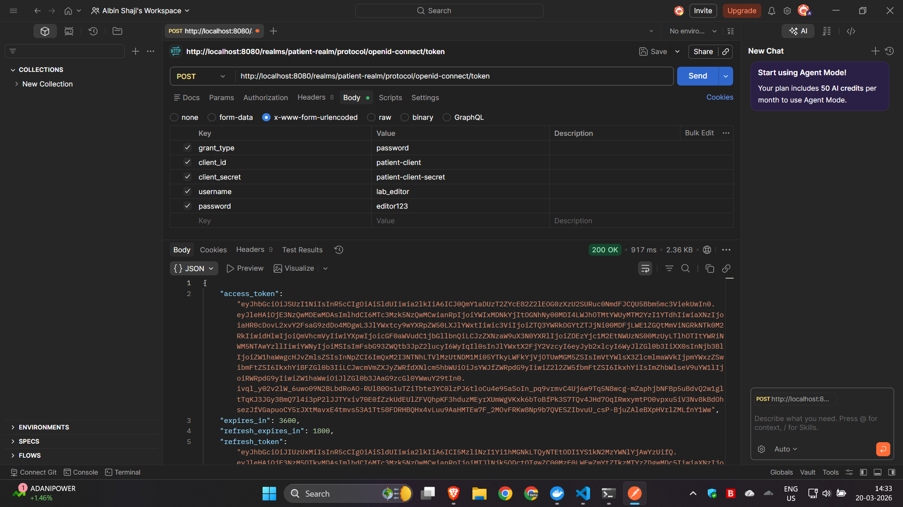
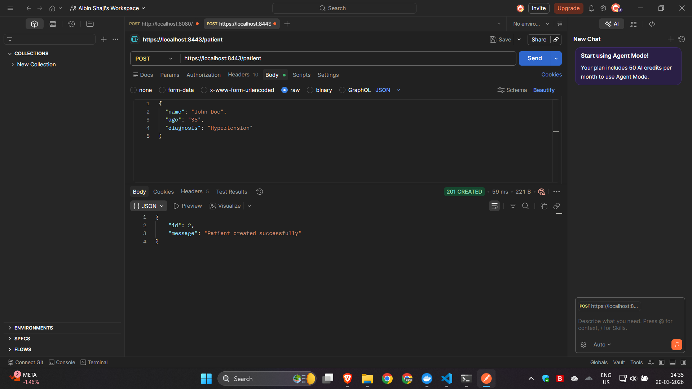
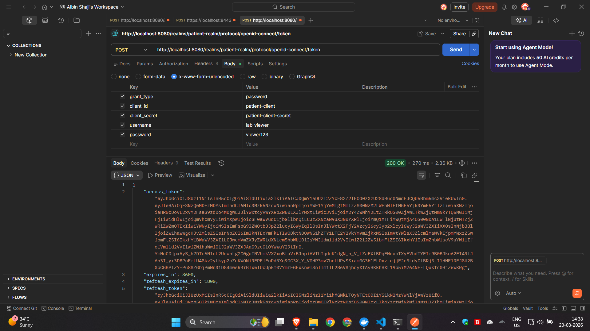
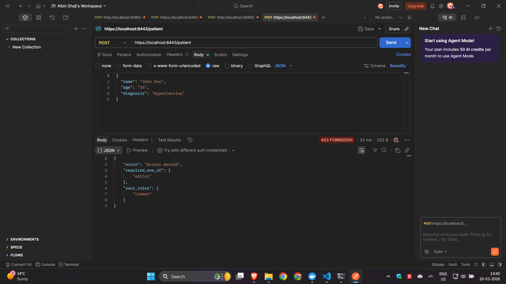
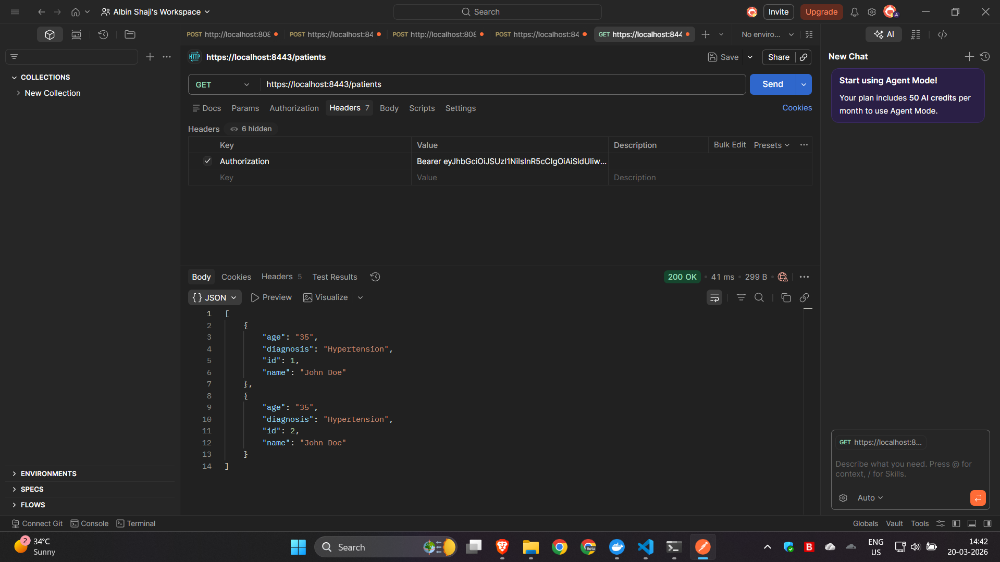
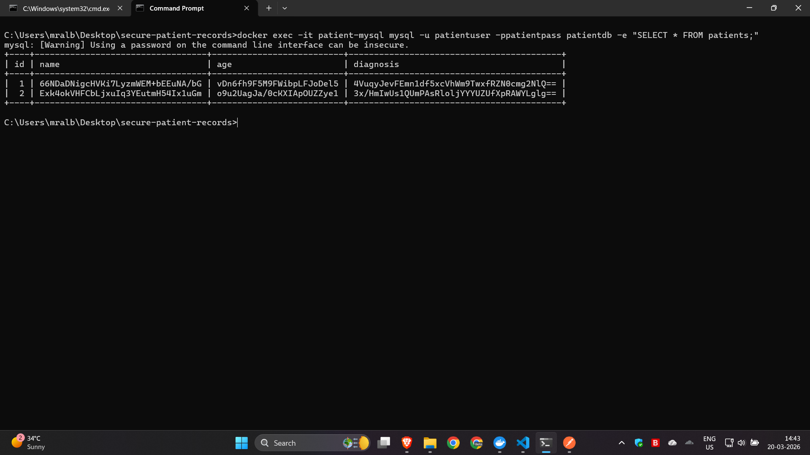
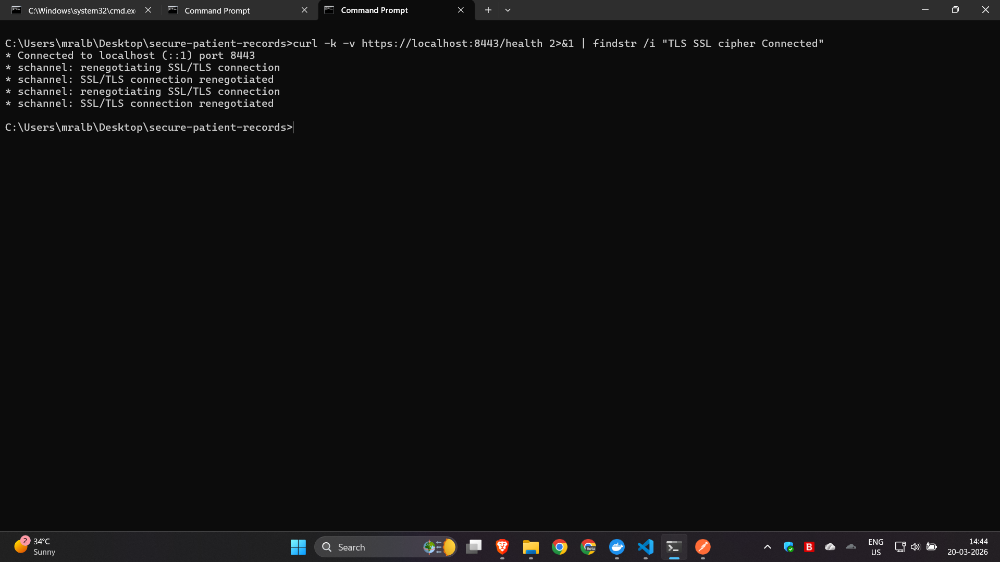
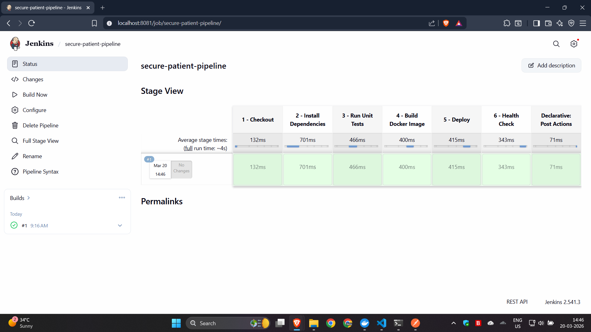

# 🏥 Secure Patient Records Workflow


> **Assignment 2 — Advanced Cloud Technologies | MCA, LEAD College Palakkad**
>
> An end-to-end secure healthcare microservice demonstrating IAM (Keycloak RBAC), TLS encryption in transit, AES-256 encryption at rest, and Jenkins CI/CD — all containerized with Docker Compose.

---

## 📋 Table of Contents

- [Overview](#-overview)
- [Architecture](#-architecture)
- [Tech Stack](#-tech-stack)
- [Project Structure](#-project-structure)
- [Security Features](#-security-features)
- [Prerequisites](#-prerequisites)
- [Complete Setup Guide A-Z](#-complete-setup-guide-a-z)
- [API Endpoints](#-api-endpoints)
- [Testing with Postman](#-testing-with-postman)
- [Demo Screenshots](#-demo-screenshots)
- [CI/CD Pipeline](#-cicd-pipeline)
- [Unit Tests](#-unit-tests)
- [How It Works](#-how-it-works)
- [Author](#-author)

---

## 🌟 Overview

This project implements a **complete, production-grade secure patient records management system** that reflects real-world DevOps and healthcare application security practices.

### What It Demonstrates

| Feature | Implementation | Port |
|---|---|---|
| 🔐 Identity & Access Management | Keycloak with RBAC (viewer + editor roles) | 8080 |
| 🔒 Encryption in Transit | TLS/HTTPS with self-signed OpenSSL certificate | 8443 |
| 🔑 Encryption at Rest | AES-256-CFB before saving to MySQL | 3306 |
| 🚀 CI/CD Pipeline | Jenkins 6-stage automated pipeline | 8081 |
| 🐳 Containerization | Docker Compose with 4 services | — |
| 🧪 Unit Testing | 7 pytest test cases covering all endpoints | — |

---

## 🏗️ Architecture

```
┌──────────────────────────────────────────────────────────────────┐
│                    Docker Compose Network                        │
│                                                                  │
│  ┌──────────────┐    ┌─────────────────┐    ┌───────────────┐    │
│  │   Keycloak   │    │   Flask API     │    │     MySQL     │    │
│  │  port: 8080  │◄──►│   port: 8443    │◄──►│  port: 3306   │    │
│  │  IAM + RBAC  │    │   HTTPS / TLS   │    │  AES-256 data │    │
│  └──────────────┘    └─────────────────┘    └───────────────┘    │
│                                                                  │
│  ┌──────────────┐                                                │
│  │   Jenkins    │                                                │
│  │  port: 8081  │                                                │
│  │   CI / CD    │                                                │
│  └──────────────┘                                                │
└──────────────────────────────────────────────────────────────────┘
```

### Request Flow

```
Postman / Client
       │
       ▼  HTTPS (TLS encrypted)
https://localhost:8443/patient
       │
       ▼
Flask API → Validate JWT Token via Keycloak JWKS
       │
       ▼
Check Role: viewer or editor?
       │
    editor ──────────────────────► AES-256 Encrypt data
       │                                    │
    viewer (GET only)                       ▼
       │                           MySQL stores ciphertext
       ▼                           (unreadable directly)
  Return decrypted
  response to client
```

---

## 🛠️ Tech Stack

| Layer | Technology | Version |
|---|---|---|
| API Framework | Flask | 3.1.0 |
| Database | MySQL | 8.0 |
| ORM | Flask-SQLAlchemy + PyMySQL | 3.1.1 / 1.1.1 |
| IAM | Keycloak | 24.0.1 |
| Encryption | cryptography (AES-256-CFB) | 44.0.2 |
| JWT Validation | python-jose | 3.3.0 |
| CI/CD | Jenkins LTS | 2.541.3 |
| Containerization | Docker + Docker Compose | 29.x / v5.x |
| Testing | pytest + pytest-flask | 8.3.5 / 1.3.0 |
| TLS | OpenSSL (self-signed cert) | built-in |
| Base Image | python:3.12-slim | — |

---

## 📁 Project Structure

```
secure-patient-records/
│
├── app/
│   ├── main.py              # Flask API — HTTPS server, all routes, DB retry logic
│   ├── models.py            # Patient DB model + AES-256 encrypt/decrypt functions
│   ├── auth.py              # Keycloak JWT validator + @require_role decorator
│   └── database.py          # MySQL connection via SQLAlchemy
│
├── tests/
│   └── test_api.py          # 7 pytest unit tests (mocked Keycloak + SQLite)
│
├── certs/
│   ├── cert.pem             # TLS certificate (auto-generated in Dockerfile)
│   └── key.pem              # TLS private key (auto-generated in Dockerfile)
│
├── jenkins/
│   └── Jenkinsfile          # 6-stage CI/CD pipeline definition
│
├── keycloak/
│   └── realm-export.json    # Pre-configured realm: viewer + editor users
│
├── Screenshots/
│   ├── 1.png                # Editor token from Keycloak
│   ├── 2.png                # Editor POST → 201 Created
│   ├── 3.png                # Viewer token from Keycloak
│   ├── 4.png                # Viewer POST → 403 Forbidden
│   ├── 5.png                # Viewer GET → 200 OK
│   ├── 6.png                # MySQL encrypted data
│   ├── 7.png                # TLS SSL proof
│   └── 8.png                # Jenkins all green
│
├── docker-compose.yml       # All 4 services orchestration
├── Dockerfile               # Flask app container definition
├── requirements.txt         # Python dependencies
└── README.md                # This file
```

---

## 🔐 Security Features

### 1. Identity & Access Management — Keycloak RBAC

| User | Password | Role | POST /patient | GET /patients |
|---|---|---|---|---|
| `lab_editor` | `editor123` | `editor` | ✅ 201 Created | ✅ 200 OK |
| `lab_viewer` | `viewer123` | `viewer` | ❌ 403 Forbidden | ✅ 200 OK |

### 2. TLS — Encryption in Transit

- API runs on **HTTPS port 8443** only
- Self-signed TLS certificate generated via OpenSSL at build time
- Confirmed with `curl -k -v` → `SSL/TLS connection renegotiated`

### 3. AES-256 — Encryption at Rest

Data is encrypted **before** saving to MySQL. Direct DB query returns:

```
name      → 66NDaDNigcHVKi7LyzmWEM+bEEuNA/bG
age       → vDn6fh9F5M9FWibpLFJoDel5
diagnosis → 4VuqyJevFEmn1df5xcVhWm9TwxfRZN0cmg2NlQ==
```

---

## ✅ Prerequisites

| Tool | Minimum Version | Check Command |
|---|---|---|
| Docker Desktop | 20.0+ | `docker --version` |
| Docker Compose | v2.0+ | `docker-compose --version` |
| Git | Any | `git --version` |
| Postman | Any | Download from postman.com |

> ⚠️ Make sure **Docker Desktop is running** before starting.

---

## 🚀 Complete Setup Guide A-Z

### STEP 1 — Clone the Repository

```cmd
git clone https://github.com/AryaLakshmi962/Secure-Health-Api
cd secure-patient-records
```

---

### STEP 2 — Start All Docker Services

```cmd
docker-compose up --build
```

> ⏳ First run takes **5-10 minutes** (downloads MySQL, Keycloak, Jenkins, Python images).

Wait until you see these messages in the logs:

```
patient-api      | 🚀 Starting Secure Patient Records API on https://0.0.0.0:8443
patient-keycloak | Keycloak 24.0.1 started in XX.Xs
patient-mysql    | ready for connections. port: 3306
patient-jenkins  | Jenkins is fully up and running
```

---

### STEP 3 — Verify All Containers Running

Open a new CMD window:

```cmd
docker ps
```

Expected — 4 containers running:

```
patient-api       → https://localhost:8443
patient-keycloak  → http://localhost:8080
patient-mysql     → port 3306
patient-jenkins   → http://localhost:8081
```

---

### STEP 4 — Check Services in Browser

| Service | URL | What You See |
|---|---|---|
| Keycloak Admin | http://localhost:8080 | Keycloak login page |
| Jenkins | http://localhost:8081 | Jenkins dashboard |
| API Health | https://localhost:8443/health | `{"status": "ok"}` |

---

### STEP 5 — Disable SSL Verification in Postman

> Required because our certificate is self-signed.

```
Postman → Settings (gear icon) → General → SSL Certificate Verification → OFF
```

---

### STEP 6 — Get Editor Token from Keycloak

In Postman:

```
Method: POST
URL:    http://localhost:8080/realms/patient-realm/protocol/openid-connect/token
Body:   x-www-form-urlencoded
```

| Key | Value |
|---|---|
| `grant_type` | `password` |
| `client_id` | `patient-client` |
| `client_secret` | `patient-client-secret` |
| `username` | `lab_editor` |
| `password` | `editor123` |

Response: `200 OK` with `access_token`. **Copy the token.**

---

### STEP 7 — Create a Patient Record (Editor)

```
Method: POST
URL:    https://localhost:8443/patient
```

**Headers:**

| Key | Value |
|---|---|
| `Authorization` | `Bearer <paste_editor_token>` |
| `Content-Type` | `application/json` |

**Body → raw → JSON:**

```json
{
  "name": "John Doe",
  "age": "35",
  "diagnosis": "Hypertension"
}
```

Expected: **`201 CREATED`**

```json
{
  "id": 1,
  "message": "Patient created successfully"
}
```

---

### STEP 8 — Test RBAC with Viewer Token

Get viewer token — change in Keycloak request:

```
username = lab_viewer
password = viewer123
```

Try POST with viewer token → Expected: **`403 FORBIDDEN`**

```json
{
  "error": "Access denied",
  "required_one_of": ["editor"],
  "your_roles": ["viewer"]
}
```

---

### STEP 9 — Get All Patients (Viewer)

```
Method: GET
URL:    https://localhost:8443/patients
Authorization: Bearer <viewer_token>
```

Expected: **`200 OK`** with decrypted patient list.

---

### STEP 10 — Prove AES Encryption in DB

```cmd
docker exec -it patient-mysql mysql -u patientuser -ppatientpass patientdb -e "SELECT * FROM patients;"
```

You will see encrypted ciphertext — not plain text. ✅

---

### STEP 11 — Prove TLS Encryption

```cmd
curl -k -v https://localhost:8443/health 2>&1 | findstr /i "TLS SSL cipher Connected"
```

Expected output confirms SSL/TLS handshake. ✅

---

### STEP 12 — Jenkins CI/CD Pipeline

Open **http://localhost:8081** → Your pipeline `secure-patient-pipeline` should be there.

Click **Build Now** → Watch all 6 stages go green ✅

---

### STEP 13 — Stop Everything

```cmd
docker-compose down
```

To also remove volumes (MySQL data):

```cmd
docker-compose down -v
```

---

## 📡 API Endpoints

| Method | Endpoint | Auth | Role | Description |
|---|---|---|---|---|
| `GET` | `/health` | ❌ | — | Public health check |
| `POST` | `/patient` | ✅ JWT | `editor` | Create encrypted patient record |
| `GET` | `/patient/<id>` | ✅ JWT | `viewer` or `editor` | Get one patient (decrypted) |
| `GET` | `/patients` | ✅ JWT | `viewer` or `editor` | Get all patients (decrypted) |

---

## 🧪 Testing with Postman

### All Requests Quick Reference

```
# 1. Get editor token
POST http://localhost:8080/realms/patient-realm/protocol/openid-connect/token
Body: grant_type=password, client_id=patient-client,
      client_secret=patient-client-secret,
      username=lab_editor, password=editor123

# 2. Create patient (editor)
POST https://localhost:8443/patient
Authorization: Bearer <editor_token>
Body: {"name": "John Doe", "age": "35", "diagnosis": "Hypertension"}

# 3. Get all patients
GET https://localhost:8443/patients
Authorization: Bearer <any_valid_token>

# 4. Get one patient
GET https://localhost:8443/patient/1
Authorization: Bearer <any_valid_token>

# 5. Test RBAC (viewer cannot create)
POST https://localhost:8443/patient
Authorization: Bearer <viewer_token>
→ Returns 403 Forbidden
```

---

## 📸 Demo Screenshots

### 1 — Editor Token from Keycloak (200 OK)
> IAM working — editor authenticates and receives JWT with `editor` role.



---

### 2 — Editor POST Patient (201 Created)
> Editor creates patient record via HTTPS API. Data is AES-encrypted before saving.



---

### 3 — Viewer Token from Keycloak (200 OK)
> Viewer authenticates with restricted `viewer` role only.



---

### 4 — Viewer POST Patient (403 Forbidden)
> RBAC enforced — viewer cannot create records. Response shows role mismatch.



---

### 5 — Viewer GET All Patients (200 OK)
> Viewer can read records. API decrypts AES data before returning JSON.



---

### 6 — MySQL AES Encrypted Data at Rest
> Direct DB query shows unreadable ciphertext — data cannot be viewed directly.



---

### 7 — TLS SSL/TLS Connection Confirmed
> curl confirms SSL/TLS handshake on port 8443 — all traffic encrypted.



---

### 8 — Jenkins All 6 Stages Green ✅
> Full CI/CD pipeline ran successfully — Checkout → Install → Test → Build → Deploy → Health Check.



---

## 🔄 CI/CD Pipeline

Access Jenkins at **http://localhost:8081**

```
Stage 1: Checkout          ✅ Source code verified
Stage 2: Install Deps      ✅ All Python packages ready
Stage 3: Run Unit Tests    ✅ 7/7 tests passed
Stage 4: Build Docker      ✅ Image built successfully
Stage 5: Deploy            ✅ API live on https://localhost:8443
Stage 6: Health Check      ✅ API responding correctly
```

---

## 🧪 Unit Tests

| # | Test | Endpoint | Role | Expected |
|---|---|---|---|---|
| 1 | Health check | `GET /health` | None | 200 OK |
| 2 | Editor creates | `POST /patient` | editor | 201 Created |
| 3 | Viewer blocked | `POST /patient` | viewer | 403 Forbidden |
| 4 | Viewer reads one | `GET /patient/1` | viewer | 200 OK |
| 5 | Editor reads all | `GET /patients` | editor | 200 OK |
| 6 | Missing fields | `POST /patient` | editor | 400 Bad Request |
| 7 | No token | `GET /patients` | none | 401 Unauthorized |

---

## 💻 How It Works

### AES-256 Encryption (`app/models.py`)

```python
def encrypt(plain_text: str) -> str:
    iv = os.urandom(16)                        # Random IV per record
    cipher = Cipher(algorithms.AES(AES_KEY), modes.CFB(iv))
    encryptor = cipher.encryptor()
    encrypted = encryptor.update(plain_text.encode()) + encryptor.finalize()
    return base64.b64encode(iv + encrypted).decode()  # IV + ciphertext
```

### JWT Role Validation (`app/auth.py`)

```python
def require_role(*roles):
    def decorator(f):
        @wraps(f)
        def wrapper(*args, **kwargs):
            token = request.headers["Authorization"].split(" ")[1]
            claims = decode_token(token)          # Validate with Keycloak JWKS
            user_roles = claims["realm_access"]["roles"]
            if not any(r in user_roles for r in roles):
                return jsonify({"error": "Access denied",
                                "your_roles": user_roles}), 403
            return f(*args, **kwargs)
        return wrapper
    return decorator
```

### DB Retry Logic (`app/main.py`)

```python
def init_db_with_retry(app, retries=10, delay=5):
    for attempt in range(1, retries + 1):
        try:
            init_db(app)
            print("✅ Database connected and tables created.")
            return
        except Exception:
            print(f"⏳ Retrying DB ({attempt}/{retries})...")
            time.sleep(delay)
```

---

## 👤 Author

**Arya Lakshmi**

- 🎓 MCA Student — LEAD College, Palakkad, Kerala (2026)
- 🐙 GitHub: [@Arya-Lakshmi](https://github.com/AryaLakshmi962)

---

